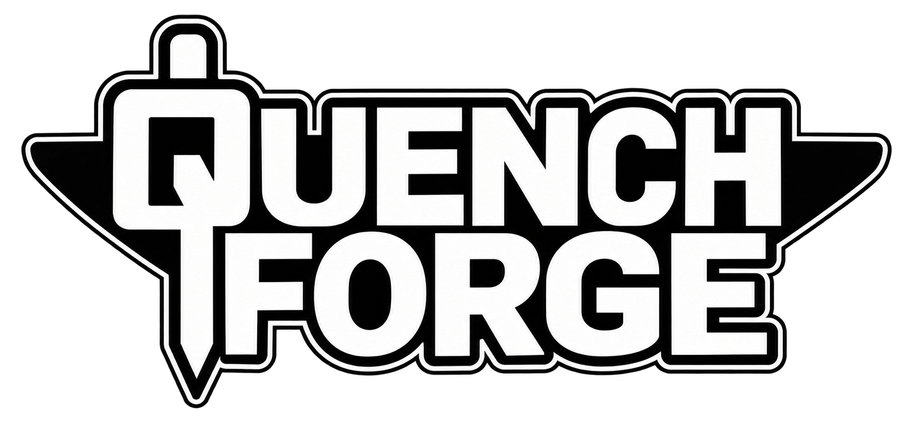
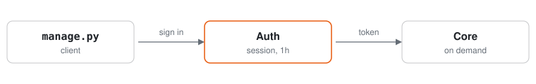

<div align="center">



**One file. Every tool.**

[](https://www.python.org/)
[](https://supabase.com/)
[](#)
[](#access)
[](LICENSE)
[](#requirements)

</div>

---

## Quick start

```bash
python manage.py login
```

Run `python manage.py` for all commands.

## Requirements

| Component | Requirement |
|---|---|
| Python | 3.9+ |
| Packages | stdlib only |
| Network | HTTPS to `*.supabase.co` |

## Access

| Role | Status |
|---|---|
| Superadmin | Active |
| Admin | Active |
| Public (SSO) | Coming soon |

## How it works

<p align="center">
  <picture>
    <source media="(prefers-color-scheme: dark)" srcset=".github/assets/flow-dark.svg">
    
  </picture>
</p>

No secrets ship in this repository. Updates roll out server-side; `manage.py` never changes.

## Security

Credentials are verified server-side and sessions expire after one hour.
See [SECURITY.md](.github/SECURITY.md) for reporting.

---

<div align="center">

[![License](https://img.shields.io/badge/License-1F2328?style=for-the-badge&logo=data%3Aimage%2Fsvg%2Bxml%3Bbase64%2CPHN2ZyBmaWxsPSJ3aGl0ZSIgeG1sbnM9Imh0dHA6Ly93d3cudzMub3JnLzIwMDAvc3ZnIiB3aWR0aD0iMTYiIGhlaWdodD0iMTYiIHZpZXdCb3g9IjAgMCAxNiAxNiI%2BPHBhdGggZD0iTTguNzUuNzVWMmguOTg1Yy4zMDQgMCAuNjAzLjA4Ljg2Ny4yMzFsMS4yOS43MzZjLjAzOC4wMjIuMDguMDMzLjEyNC4wMzNoMi4yMzRhLjc1Ljc1IDAgMCAxIDAgMS41aC0uNDI3bDIuMTExIDQuNjkyYS43NS43NSAwIDAgMS0uMTU0LjgzOGwtLjUzLS41My41MjkuNTMxLS4wMDEuMDAyLS4wMDIuMDAyLS4wMDYuMDA2LS4wMDYuMDA1LS4wMS4wMS0uMDQ1LjA0Yy0uMjEuMTc2LS40NDEuMzI3LS42ODYuNDVDMTQuNTU2IDEwLjc4IDEzLjg4IDExIDEzIDExYTQuNDk4IDQuNDk4IDAgMCAxLTIuMDIzLS40NTQgMy41NDQgMy41NDQgMCAwIDEtLjY4Ni0uNDVsLS4wNDUtLjA0LS4wMTYtLjAxNS0uMDA2LS4wMDYtLjAwNC0uMDA0di0uMDAxYS43NS43NSAwIDAgMS0uMTU0LS44MzhMMTIuMTc4IDQuNWgtLjE2MmMtLjMwNSAwLS42MDQtLjA3OS0uODY4LS4yMzFsLTEuMjktLjczNmEuMjQ1LjI0NSAwIDAgMC0uMTI0LS4wMzNIOC43NVYxM2gyLjVhLjc1Ljc1IDAgMCAxIDAgMS41aC02LjVhLjc1Ljc1IDAgMCAxIDAtMS41aDIuNVYzLjVoLS45ODRhLjI0NS4yNDUgMCAwIDAtLjEyNC4wMzNsLTEuMjg5LjczN2MtLjI2NS4xNS0uNTY0LjIzLS44NjkuMjNoLS4xNjJsMi4xMTIgNC42OTJhLjc1Ljc1IDAgMCAxLS4xNTQuODM4bC0uNTMtLjUzLjUyOS41MzEtLjAwMS4wMDItLjAwMi4wMDItLjAwNi4wMDYtLjAxNi4wMTUtLjA0NS4wNGMtLjIxLjE3Ni0uNDQxLjMyNy0uNjg2LjQ1QzQuNTU2IDEwLjc4IDMuODggMTEgMyAxMWE0LjQ5OCA0LjQ5OCAwIDAgMS0yLjAyMy0uNDU0IDMuNTQ0IDMuNTQ0IDAgMCAxLS42ODYtLjQ1bC0uMDQ1LS4wNC0uMDE2LS4wMTUtLjAwNi0uMDA2LS4wMDQtLjAwNHYtLjAwMWEuNzUuNzUgMCAwIDEtLjE1NC0uODM4TDIuMTc4IDQuNUgxLjc1YS43NS43NSAwIDAgMSAwLTEuNWgyLjIzNGEuMjQ5LjI0OSAwIDAgMCAuMTI1LS4wMzNsMS4yODgtLjczN2MuMjY1LS4xNS41NjQtLjIzLjg2OS0uMjNoLjk4NFYuNzVhLjc1Ljc1IDAgMCAxIDEuNSAwWm0yLjk0NSA4LjQ3N2MuMjg1LjEzNS43MTguMjczIDEuMzA1LjI3M3MxLjAyLS4xMzggMS4zMDUtLjI3M0wxMyA2LjMyN1ptLTEwIDBjLjI4NS4xMzUuNzE4LjI3MyAxLjMwNS4yNzNzMS4wMi0uMTM4IDEuMzA1LS4yNzNMMyA2LjMyN1oiLz48L3N2Zz4%3D)](LICENSE)
[![Security](https://img.shields.io/badge/Security-1F2328?style=for-the-badge&logo=data%3Aimage%2Fsvg%2Bxml%3Bbase64%2CPHN2ZyBmaWxsPSJ3aGl0ZSIgeG1sbnM9Imh0dHA6Ly93d3cudzMub3JnLzIwMDAvc3ZnIiB3aWR0aD0iMTYiIGhlaWdodD0iMTYiIHZpZXdCb3g9IjAgMCAxNiAxNiI%2BPHBhdGggZD0ibTguNTMzLjEzMyA1LjI1IDEuNjhBMS43NSAxLjc1IDAgMCAxIDE1IDMuNDhWN2MwIDEuNTY2LS4zMiAzLjE4Mi0xLjMwMyA0LjY4Mi0uOTgzIDEuNDk4LTIuNTg1IDIuODEzLTUuMDMyIDMuODU1YTEuNjk3IDEuNjk3IDAgMCAxLTEuMzMgMGMtMi40NDctMS4wNDItNC4wNDktMi4zNTctNS4wMzItMy44NTVDMS4zMiAxMC4xODIgMSA4LjU2NiAxIDdWMy40OGExLjc1IDEuNzUgMCAwIDEgMS4yMTctMS42NjdsNS4yNS0xLjY4YTEuNzQ4IDEuNzQ4IDAgMCAxIDEuMDY2IDBabS0uNjEgMS40MjkuMDAxLjAwMS01LjI1IDEuNjhhLjI1MS4yNTEgMCAwIDAtLjE3NC4yMzdWN2MwIDEuMzYuMjc1IDIuNjY2IDEuMDU3IDMuODU5Ljc4NCAxLjE5NCAyLjEyMSAyLjM0MiA0LjM2NiAzLjI5OGEuMTk2LjE5NiAwIDAgMCAuMTU0IDBjMi4yNDUtLjk1NyAzLjU4Mi0yLjEwMyA0LjM2Ni0zLjI5N0MxMy4yMjUgOS42NjYgMTMuNSA4LjM1OCAxMy41IDdWMy40OGEuMjUuMjUgMCAwIDAtLjE3NC0uMjM4bC01LjI1LTEuNjhhLjI1LjI1IDAgMCAwLS4xNTMgMFpNOS41IDYuNWMwIC41MzYtLjI4NiAxLjAzMi0uNzUgMS4zdjIuNDVhLjc1Ljc1IDAgMCAxLTEuNSAwVjcuOEExLjUgMS41IDAgMSAxIDkuNSA2LjVaIi8%2BPC9zdmc%2B)](.github/SECURITY.md)
[](.github/CONTRIBUTING.md)

<sub>© 2026 QuenchForge. All rights reserved.</sub>

</div>
